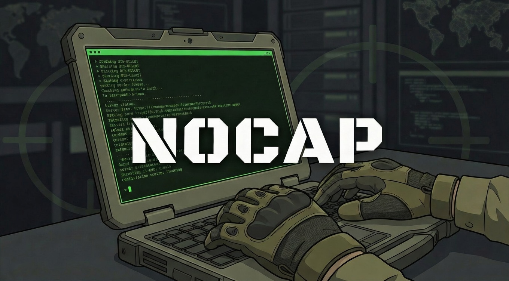

# NOCAP

<p align="center">
  
</p>

> **N**o-overhead **C**apture. **A**utomatic **P**ath routing.
> *Capture tool output. No cap.*

NOCAP is a zero-dependency command capture wrapper built for security operators.
Drop it in front of any tool and it handles the rest: smart file naming, engagement
directory routing, auto subdir routing, collision avoidance, live TTY output,
completion status with elapsed time, and interactive capture browsing.
No more `| tee recon/nmap-sCV.txt` one-liners.

[](https://bltsec.com/posts/nocap/)
[](https://youtu.be/tUDXFoZIkg4)

```bash
# $TARGET set or op_* tmux session active → routes to /workspace/<target>/
export TARGET=10.10.10.5
cap nmap -sCV 10.10.10.5
# → /workspace/10.10.10.5/nmap_sCV.txt

# No engagement context → writes to current directory
cap nmap -sCV 10.10.10.5
# → ./nmap_sCV.txt
```

---

## Install

```bash
pipx install git+https://github.com/BLTSEC/NOCAP.git
```

Or directly from source:

```bash
git clone https://github.com/BLTSEC/nocap
pipx install ./nocap
```

---

## Usage

```
cap [options] [subdir] <command> [args...]
cap grab [options] [command...]
cap last | cat | tail | open | rm | summary | render
cap ls [subdir]
cap update
```

### Options

| Flag | Description |
|---|---|
| `-n`, `--note <label>` | Append a custom label to the output filename |
| `-s`, `--subdir <name>` | Write to a custom subdir (created if needed) |
| `-a`, `--auto` | Auto-route to subdir based on tool name (opt-in) |
| `-D`, `--dry-run` | Show where output would go without running |

### Subcommands

| Command | Description |
|---|---|
| `cap last` | Print the path of the last captured file |
| `cap cat` | Dump last capture to stdout with clean rendered output |
| `cap tail` | Follow last capture from the start — useful while a scan runs in another pane |
| `cap open` | Open last capture in `$EDITOR`, or rendered through `less` |
| `cap rm` | Delete the last captured file |
| `cap summary [keyword]` | Compact table of all captures, or search across them by keyword |
| `cap render [file]` | Render a capture (or the last one) through the VT100 cleaner — strips ANSI, progress bars, cursor noise |
| `cap ls [subdir]` | Browse captures interactively (fzf) or list them. Accepts any subdir name. |
| `cap grab [cmd...]` | Retroactively capture the last command's output from tmux scrollback |
| `cap update` | Update nocap to the latest version via pipx |

### Environment

| Variable | Description |
|---|---|
| `NOCAP_AUTO=1` | Enable `--auto` subdir routing by default without the flag |
| `NOCAP_WORKSPACE=path` | Override the base workspace directory (default: `/workspace`) |

---

## Examples

```bash
# Basic capture — output goes to cwd by default
cap nmap -sCV 10.10.10.5

# Explicit subdir
cap recon gobuster dir -u http://10.10.10.5 -w /wordlist.txt
cap loot hashcat -m 1000 hashes.txt /wordlist.txt

# Custom subdir (created automatically if it doesn't exist)
cap -s pivoting chisel client 10.10.14.5:8080 R:socks
cap -s ad-enum bloodhound-python -u user -p pass -d corp.local

# Add a note to distinguish runs with the same flags
cap -n after-creds nmap -sCV 10.10.10.5
cap -n authenticated feroxbuster -u http://10.10.10.5 -x php,html

# Combined short flags
cap -an after-creds nmap -sCV 10.10.10.5    # -a and -n together
cap -aD nmap -sCV 10.10.10.5               # dry-run with auto routing

# Auto-routing: infers subdir from the tool name
cap --auto nmap -sCV 10.10.10.5       # → recon/nmap_sCV.txt
cap --auto hashcat -m 1000 h.txt wl   # → loot/hashcat_m_1000.txt
cap --auto msfconsole                 # → exploitation/msfconsole.txt

# NOCAP_AUTO=1: make auto-routing the default, no flag needed
export NOCAP_AUTO=1
cap nmap -sCV 10.10.10.5             # → recon/ automatically

# Preview routing without running
cap -D feroxbuster -u http://10.10.10.5

# Retroactive capture — forgot to cap? grab it from tmux scrollback
cap grab                                     # auto-detect last command
cap grab nmap -sCV 10.10.10.5               # explicit command
cap grab -n initial -s recon                 # with note + subdir

# Work with the last captured file
cap last                             # print the path
cap cat                              # dump to stdout
cap tail                             # follow live — watch a scan from another pane
cap open                             # open in $EDITOR / bat / less
cap rm                               # delete it
grep -i password $(cap last)
cp $(cap last) ~/report/evidence.txt

# Engagement overview
cap summary                          # timestamp, lines, size, path for all captures
cap summary passwords                # find credentials across all captures
cap summary hashes                   # find crackable hashes
cap summary ports                    # open ports from all nmap/scan output
cap summary admin                    # literal keyword search
cap ls                               # interactive fzf browser
cap ls recon                         # scoped to recon/
cap ls pivoting                      # any custom subdir works

# Update to latest
cap update
```

---

## Smart Routing

NOCAP resolves your engagement directory automatically — no configuration needed.

| Priority | Condition | Output location |
|---|---|---|
| 1 | `$TARGET` env var is set | `$NOCAP_WORKSPACE/$TARGET/<subdir>/` |
| 2 | Active tmux session named `op_*` | `$NOCAP_WORKSPACE/<target>/<subdir>/` |
| 3 | Fallback | `./<subdir>/` (current directory) |

The workspace root defaults to `/workspace` and can be overridden:

```bash
export NOCAP_WORKSPACE=/ops
export TARGET=10.10.10.5
cap nmap -sCV 10.10.10.5
# → /ops/10.10.10.5/nmap_sCV.txt
```

Set `TARGET` manually for non-tmux workflows:

```bash
export TARGET=10.10.10.5
cap nmap -sCV 10.10.10.5
# → /workspace/10.10.10.5/nmap_sCV.txt
```

---

## Auto-Subdir Routing

With `--auto` / `-a`, NOCAP infers the engagement subdir from the tool name.
Default behavior (without the flag) writes to cwd — no routing is applied.

Set `NOCAP_AUTO=1` to make auto-routing the default for every capture without
typing the flag:

```bash
export NOCAP_AUTO=1
cap nmap -sCV 10.10.10.5       # → recon/ automatically
cap hashcat -m 1000 h.txt wl   # → loot/ automatically
```

Add it to your shell profile (`.zshrc`, `.bashrc`) or Exegol's shell init to
make it permanent.

```bash
cap --auto nmap -sCV 10.10.10.5
# → /workspace/10.10.10.5/recon/nmap_sCV.txt

cap --auto hashcat -m 1000 hashes.txt /wl.txt
# → /workspace/10.10.10.5/loot/hashcat_m_1000.txt
```

An explicit subdir always takes precedence over `--auto`:

```bash
cap -s notes nmap -sCV 10.10.10.5
# → /workspace/10.10.10.5/notes/nmap_sCV.txt
```

**Tool→subdir map:**

| Subdir | Tools |
|---|---|
| `recon` | **Network:** nmap, rustscan, masscan, autorecon, naabu, udpx, netdiscover, fping, arp-scan, zmap, unicornscan |
| | **Web fuzzing:** gobuster, feroxbuster, ffuf, wfuzz, dirsearch, dirb, arjun, kr |
| | **Web scanning:** whatweb, nikto, nuclei, httpx, httprobe, http, curl, wget, hakrawler, katana, gospider, cariddi, gau, bbot, uncover, patator, ssh-audit, searchsploit |
| | **Secrets/git:** trufflehog, gitleaks, git-dumper |
| | **CMS:** wpscan, wpprobe, joomscan, droopescan, drupwn, cmsmap, moodlescan |
| | **SSL/TLS:** testssl, sslscan, wafw00f, cors_scan |
| | **DNS/Subdomain:** dnsx, amass, subfinder, sublist3r, findomain, assetfinder, massdns, shuffledns, fierce, dnsenum, dnsrecon, dnschef, waybackurls, dig, whois |
| | **SMB/LDAP/AD:** enum4linux, enum4linux-ng, ldapsearch, smbclient, smbmap, smbclientng, rpcclient, windapsearch, ldeep, pywerview, godap, manspider, msprobe, adidnsdump, daclsearch, nbtscan, smtp-user-enum, pysnaffler |
| | **SNMP/NFS:** snmpwalk, onesixtyone, showmount |
| | **Kerberos/AD collection:** kerbrute, netexec, crackmapexec, sprayhound, smartbrute, ldapdomaindump, bloodhound-python, rusthound, rusthound-ce |
| | **OSINT:** theHarvester, recon-ng, spiderfoot, sherlock, maigret, holehe, ghunt, phoneinfoga, censys, GitFive, photon, finalrecon, maltego |
| | **Cloud:** scout, cloudsplaining, prowler, cloudmapper.py |
| | **WiFi:** bettercap, hcxdumptool, airodump-ng, kismet |
| `screenshots` | eyewitness, EyeWitness, gowitness, aquatone, webscreenshot |
| `loot` | **Cracking:** hashcat, john, hydra, medusa, legba, fcrackzip, pdfcrack, nth, haiti, pkcrack, ncrack, aircrack-ng, hcxpcapngtool |
| | **Forensics/stego:** volatility, volatility3, binwalk, foremost, steghide, stegseek, exiftool, zsteg |
| | **Dumping:** pypykatz, lsassy, donpapi, gosecretsdump, dploot, masky, crackhound, keytabextract, PCredz, firefox_decrypt |
| `exploitation` | **C2/Frameworks:** msfconsole, msfvenom, msfdb, sliver-server, sliver-client, ps-empire, havoc, Villain.py, pwncat-vl, pwncat-cs, routersploit |
| | **Tunneling:** ligolo-ng, chisel, socat |
| | **Web:** sqlmap, weevely, xsstrike, nosqlmap, gopherus, ssrfmap, ysoserial, phpggc, XXEinjector, php_filter_chain_generator, jdwp-shellifier, byp4xx, h2csmuggler, smuggler, tomcatWarDeployer, clusterd, token-exploiter, dalfox, commix, tplmap, ghauri, jwt_tool, swaks |
| | **AD/Windows:** evil-winrm, evil-winrm-py, mitm6, ntlmrelayx.py, krbrelayx.py, aclpwn, coercer, petitpotam.py, dfscoerce.py, shadowcoerce.py, pywhisker, targetedKerberoast.py, bloodyAD, autobloody, gpoddity, goexec, certipy, noPac.py, pre2k, passthecert.py, sccmhunter.py, pxethief, remotemonologue.py |
| | **Impacket:** psexec.py, wmiexec.py, smbexec.py, atexec.py, dcomexec.py, secretsdump.py, GetNPUsers.py, GetUserSPNs.py |

---

## `cap last` / `cat` / `tail` / `open` / `rm`

All last-file subcommands operate on the most recently captured file.

```bash
cap last                    # print the path
cap cat                     # dump to stdout — rendered clean (no ANSI/progress noise)
cap tail                    # follow from the start — watch a running scan
cap open                    # open in $EDITOR, or rendered through less
cap rm                      # delete the capture
cap render                  # render last capture through VT100 cleaner
cap render /path/to/file    # render any capture file

# Compose last with other tools
grep -i password $(cap last)
cp $(cap last) ~/report/evidence.txt
```

`cap cat` and `cap open` automatically render captures through the built-in VT100 cleaner,
stripping ANSI escape codes, progress bar redraws, and cursor noise to produce clean readable text.
`cap open` picks the best available viewer in order: `$EDITOR` (raw file) → `less` (rendered).

---

## `cap summary`

Without a keyword, prints a compact table of all captures — timestamp, line count, size, and relative path:

```
2026-02-23 14:32  1234 lines   45.2K  recon/nmap_sCV.txt
2026-02-23 14:28   892 lines   28.1K  recon/gobuster_dir.txt
2026-02-23 13:55   310 lines    9.8K  loot/hashcat_m_1000.txt
```

With a keyword, searches across all captures and prints matching lines grouped by file:

```bash
cap summary passwords            # credential patterns (netexec, hydra, config files)
cap summary hashes               # NTLM, MD5, SHA1, SHA256 patterns
cap summary users                # username/login/account patterns
cap summary emails               # email addresses
cap summary ports                # open port lines (nmap: 80/tcp open)
cap summary vulns                # CVEs, vulnerable, exploitable, severity: critical/high
cap summary urls                 # HTTP/HTTPS URLs
cap summary admin                # literal keyword — any term
cap summary "HTB{.*}"            # regex — match HTB flags
cap summary "FLAG{[^}]+}"        # regex — generic CTF flag format
cap summary "\d+\.\d+\.\d+\.\d+" # regex — all IPs across every capture
```

The keyword is first matched against named patterns, then tried as a regex, then
falls back to a literal case-insensitive search if the regex is invalid.

Output groups matches by file with the filename highlighted:

```
recon/netexec_smb.txt
  [+] CORP\administrator:Password123! (Pwn3d!)

loot/hashcat_m_1000.txt
  admin:aad3b435b51404eeaad3b435b51404ee:32ed87bdb5fdc5e9cba88547376818d4

recon/nmap_sCV.txt
  80/tcp   open  http    Apache httpd 2.4.38
  443/tcp  open  https   Apache httpd 2.4.38
```

---

## `cap ls`

Lists all captures for the current engagement. Uses **fzf** with rendered preview if
available, falls back to a compact table (relative paths, human-readable sizes, line
counts). Preview renders captures through the VT100 cleaner for readable output.

The subdir argument accepts any directory name — not just the built-in ones:

```bash
cap ls             # all files under current engagement dir, newest first
cap ls recon       # scoped to recon/ subdir
cap ls pivoting    # any custom subdir works
```

---

## `cap grab`

Retroactive capture — for when you forget to `cap` a command. If you're in tmux, `cap grab`
pulls the last command's output from the pane scrollback and writes a standard cap file.

```bash
# Auto-detect last command from shell history
cap grab

# Explicit command — searches scrollback for this specific output
cap grab nmap -sCV 10.10.10.5

# Works with all standard flags
cap grab -n initial                          # add a note
cap grab -s recon                            # route to subdir
cap grab -a                                  # auto-route by tool name
cap grab -n after-creds nmap -sCV 10.10.10.5 # explicit command + note
```

How it works:
1. Captures the full tmux pane scrollback (`tmux capture-pane`)
2. Detects the last command from shell history (zsh and bash), or uses the command you provide
3. Extracts the output between the command line and the `cap grab` prompt
4. Writes a file with the same `Command: / Date: / ---` header as a live capture

Requires tmux — that's where the scrollback buffer lives. Outside tmux, you'll get a
clear error with a tip to use `cap <command>` next time.

---

## Updating

```bash
cap update
```

Re-installs nocap from the latest commit on GitHub using `pipx install --force`.
Requires pipx (the same tool used to install nocap).

---

## Auto-Named Output

NOCAP derives a clean filename from your command. IPs (v4 and v6), URLs, absolute
paths, wordlists, hostnames, and numeric values are stripped automatically.
Meaningful flags and subcommands become the filename.

| Command | Output file |
|---|---|
| `cap nmap -sCV 10.10.10.5` | `nmap_sCV.txt` |
| `cap nmap -p- --min-rate 5000 10.10.10.5` | `nmap_p-_min-rate.txt` |
| `cap gobuster dir -u http://10.10.10.5 -w /wl.txt` | `gobuster_dir.txt` |
| `cap netexec smb 10.10.10.5 -u admin -p pass` | `netexec_smb.txt` |
| `cap feroxbuster -u http://10.10.10.5 -x php,html` | `feroxbuster_x_phphtml.txt` |
| `cap loot hashcat -m 1000 hashes.txt /wl.txt` | `loot/hashcat_m_1000.txt` |
| `cap -n after-creds nmap -sCV 10.10.10.5` | `nmap_sCV_after-creds.txt` |

Collisions are resolved automatically and atomically (race-safe):

```
nmap_sCV.txt → nmap_sCV_2.txt → nmap_sCV_3.txt
```

IPv6 addresses are stripped just like IPv4:

```bash
cap nmap -sCV dead:beef::1
# → nmap_sCV.txt
```

---

## File Header

Every output file starts with a structured header:

```
Command: nmap -sCV 10.10.10.5
Date:    Fri Feb 20 14:30:52 EST 2026
---
Starting Nmap 7.94 ...
```

---

## TTY Preserved

NOCAP runs commands under a PTY so tools behave exactly as they would in a
normal terminal — colours, progress bars, and interactive prompts all work.

Shell functions and aliases (defined in `.zshrc`, `.bashrc`, etc.) are supported
automatically — if the command isn't found as a binary on `$PATH`, NOCAP wraps
the invocation in `$SHELL -ic "..."` so your shell profile is sourced.

---

## Completion Status

When a command finishes, NOCAP prints a one-line summary with exit status and elapsed time:

```
[✓] nmap_sCV.txt  (12.3s)
[✗ 1] feroxbuster_x_php.txt  (0.4s)
```

A bell (`\a`) also fires on completion so you can task-switch in tmux and get
notified when a long scan finishes.

---

## Zero Dependencies

Standard library only. Python 3.9+. No third-party packages required.
Optional enhancements if present on your PATH:

| Tool | Used by |
|---|---|
| **fzf** | `cap ls` — interactive file browser with rendered preview |
| **less** | `cap open` — pager for rendered output |

---

## Engagement Directory Structure

NOCAP integrates with the standard engagement layout:

```
/workspace/<target>/
├── recon/           ← scanning, enumeration, OSINT output
├── exploitation/    ← C2 sessions, payloads, AD attacks
├── loot/            ← cracked hashes, dumped credentials
├── screenshots/     ← eyewitness, gowitness output
└── notes/           ← operator notes
```

---

## Development

```bash
git clone https://github.com/BLTSEC/nocap
cd nocap
pipx install -e ".[dev]"   # installs nocap + pytest in editable mode

# or just run tests without installing:
PYTHONPATH=src pytest tests/ -v
```

Tests cover filename generation (`tests/test_filename.py`), argument
parsing (`tests/test_parsing.py`), and grab helpers (`tests/test_grab.py`).

---

*Built for operators who move fast and document everything.*
