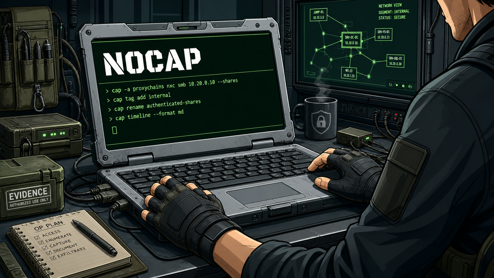

# NOCAP

<p align="center">
  
</p>

<p align="center">
  <strong>Capture tool output without breaking your flow.</strong><br>
  Automatic filenames, engagement-aware routing, live terminal output, and zero dependencies.
</p>

<p align="center">
  
  
  <a href="LICENSE"></a>
  <a href="https://bltsec.com/posts/nocap/"></a>
  <a href="https://youtu.be/tUDXFoZIkg4"></a>
</p>

<p align="center">
  <a href="#install">Install</a> ·
  <a href="#quick-start">Quick start</a> ·
  <a href="#usage">Usage</a> ·
  <a href="#smart-routing">Routing</a> ·
  <a href="#development">Development</a>
</p>

---

NOCAP wraps any command, mirrors its output to your terminal, and saves the same
session to a cleanly named file. It preserves PTY behavior, routes captures into
the right engagement directory, avoids filename collisions, and makes previous
output easy to find.

```bash
cap nmap -sCV 10.10.10.5
# live output remains visible
# saved to ./nmap_sCV.txt
```

## Why NOCAP

- **No tee chains** — replace repeated `2>&1 | tee ...` one-liners.
- **TTY preserved** — colors, progress bars, prompts, and interactive tools still work.
- **Useful filenames** — strips IPs, paths, wordlists, and numeric noise automatically.
- **Smart routing** — understands targets, tmux engagements, and common security tools.
- **Safe captures** — private `0600` files and race-safe collision handling.
- **Fast retrieval** — inspect, search, render, follow, or remove the latest capture.
- **Portable** — standard-library-only Python 3.9+.

## Install

```bash
pipx install git+https://github.com/BLTSEC/NOCAP.git
```

From a local clone:

```bash
git clone https://github.com/BLTSEC/NOCAP.git
cd NOCAP
pipx install .
```

Update later with:

```bash
cap update
```

## Quick start

```bash
# Capture to the current directory
cap nmap -sCV 10.10.10.5

# Add a label
cap -n after-creds nmap -sCV 10.10.10.5

# Choose a subdirectory
cap -s recon gobuster dir -u http://10.10.10.5 -w /wordlist.txt

# Route by tool category
cap --auto hashcat -m 1000 hashes.txt /wordlist.txt

# Preview the destination without creating files or directories
cap --dry-run feroxbuster -u http://10.10.10.5

# Capture a program whose name overlaps a NOCAP subcommand
cap -- ls -la
```

## Usage

```text
cap [options] [subdir] <command> [args...]
cap [options] -- <command matching a subcommand> [args...]
cap grab [options] [command...]
cap last | cat | tail | open | rm
cap summary [keyword]
cap render [file]
cap ls [subdir]
cap update
```

### Options

| Option | Description |
|---|---|
| `-n`, `--note LABEL` | Append a short label to the filename |
| `-s`, `--subdir NAME` | Write beneath a custom relative subdirectory |
| `-a`, `--auto` | Route by the wrapped tool's category |
| `-D`, `--dry-run` | Print the destination without changing the filesystem |
| `--` | Stop NOCAP parsing and capture a command such as `ls` or `cat` |

Run `cap --help` for the complete built-in reference.

## Capture management

| Command | Action |
|---|---|
| `cap last` | Print the most recent capture path |
| `cap cat` | Print the latest capture as clean rendered text |
| `cap tail` | Follow the latest capture from the beginning |
| `cap open` | Open it in `$EDITOR`, or render it through `less` |
| `cap rm` | Delete the latest capture |
| `cap render [file]` | Remove ANSI, cursor, and progress-bar noise |
| `cap ls [subdir]` | Browse with `fzf`, or print a compact file table |

The last-capture pointer is stored beneath `$XDG_CACHE_HOME/nocap` or
`~/.cache/nocap`.

### Search and summarize

```bash
cap summary                 # time, line count, size, and path
cap summary passwords       # named credential pattern
cap summary ports           # open TCP/UDP ports
cap summary 'CVE-2026-'     # regex or literal search
```

Named searches include `passwords`, `hashes`, `users`, `emails`, `ports`,
`vulns`, and `urls`. Discovery only includes files with NOCAP's canonical
`Command:` / `Date:` / `---` header, so unrelated `.txt` files are ignored.

## Smart routing

NOCAP resolves the engagement directory in this order:

| Priority | Context | Destination root |
|---:|---|---|
| 1 | `$LOADOUT_TARGET` | `$NOCAP_WORKSPACE/$LOADOUT_TARGET` |
| 2 | `$TARGET` | `$NOCAP_WORKSPACE/$TARGET` |
| 3 | tmux session named `op_*` | `$NOCAP_WORKSPACE/<target>` |
| 4 | No engagement context | Current directory |

`NOCAP_WORKSPACE` defaults to `/workspace`. If that root does not exist,
NOCAP safely falls back to the current directory.

```bash
export NOCAP_WORKSPACE=/workspace
export TARGET=10.10.10.5

cap -s recon nmap -sCV "$TARGET"
# /workspace/10.10.10.5/recon/nmap_sCV.txt
```

Custom subdirectories may be nested, but must remain relative. Absolute paths
and `..` traversal are rejected.

### Automatic tool categories

Enable per-command routing with `--auto`, or globally with `NOCAP_AUTO=1`.

| Directory | Representative tools |
|---|---|
| `recon/` | nmap, rustscan, ffuf, feroxbuster, nuclei, netexec, bloodhound-python |
| `screenshots/` | eyewitness, gowitness, aquatone |
| `loot/` | hashcat, john, volatility, pypykatz, donpapi |
| `exploitation/` | msfconsole, sqlmap, certipy, evil-winrm, Impacket tools |

An explicit subdirectory always wins over automatic routing. See
[`src/nocap/tools.py`](src/nocap/tools.py) for the complete mapping.

## Automatic filenames

NOCAP keeps meaningful flags and target hints while removing noisy or sensitive
path components.

| Command | Capture |
|---|---|
| `cap nmap -sCV 10.10.10.5` | `nmap_sCV.txt` |
| `cap nmap -sCV target.htb` | `nmap_sCV_target.txt` |
| `cap gobuster dir -u https://portal.example.local -w /wl.txt` | `gobuster_dir_portal.txt` |
| `cap -n authenticated nmap -sCV target.htb` | `nmap_sCV_target_authenticated.txt` |

Collisions are resolved atomically:

```text
nmap_sCV.txt  →  nmap_sCV_2.txt  →  nmap_sCV_3.txt
```

Every capture starts with reproducible context:

```text
Command: nmap -sCV 10.10.10.5
Date:    Wed Jul 15 14:30:52 CDT 2026
---
```

## Grab missed output

Forgot to prefix a command with `cap`? Inside tmux, recover it from scrollback:

```bash
cap grab                              # detect the previous command from history
cap grab nmap -sCV 10.10.10.5        # specify the command explicitly
cap grab -n initial -s recon          # label and route the recovered output
```

`cap grab` writes the same header and file format as a live capture. It requires
tmux because the pane scrollback is the source of the recovered output.

## Environment

| Variable | Purpose |
|---|---|
| `NOCAP_AUTO=1` | Enable automatic tool routing by default |
| `NOCAP_WORKSPACE=PATH` | Change the workspace root from `/workspace` |
| `LOADOUT_TARGET=NAME` | Prefer a normalized engagement directory name |
| `TARGET=VALUE` | Select the current engagement when no loadout name exists |
| `XDG_CACHE_HOME=PATH` | Change the cache root for the last-capture pointer |
| `EDITOR=COMMAND` | Select the viewer used by `cap open` |

## Development

```bash
git clone https://github.com/BLTSEC/NOCAP.git
cd NOCAP
pipx install -e ".[dev]"

PYTHONPATH=src pytest -q
```

| Module | Responsibility |
|---|---|
| `cli.py` | Argument parsing and live-capture orchestration |
| `filename.py` | Safe filenames and atomic collision handling |
| `pty.py` | PTY execution, terminal sizing, and I/O forwarding |
| `rendering.py` | ANSI/VT100 cleanup and capture viewing |
| `routing.py` | Engagement and output-directory resolution |
| `subcommands.py` | Capture discovery, tmux recovery, and subcommands |
| `tools.py` | Tool-to-directory routing data |

## License

[MIT](LICENSE)

---

<p align="center"><strong>No-overhead Capture. Automatic Path routing.</strong></p>
